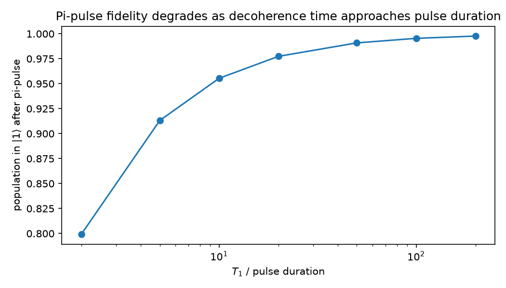
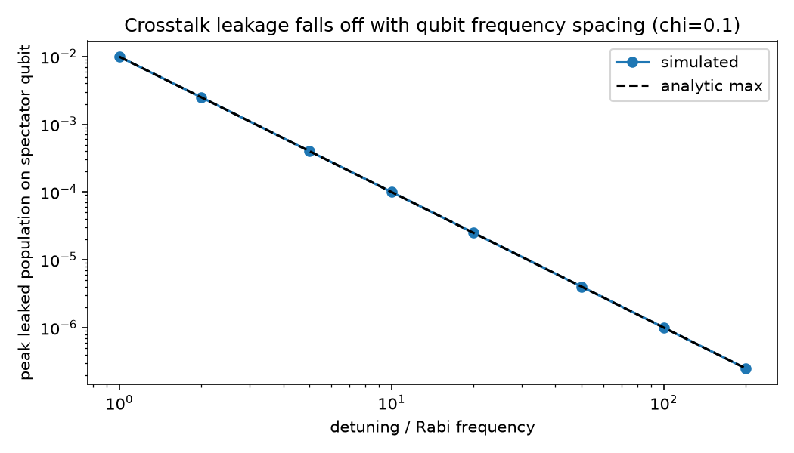

# Quantum Control Simulation: A Software Study of Classical Control Problems in Qubit Hardware

## Problem Statement

Qubits are quantum, but the hardware that controls them is not. Every gate
applied to a real qubit passes through classical infrastructure — arbitrary
waveform generators, amplifiers, mixers, cabling, and shared control
lines — and every piece of that chain is imperfect: amplitude and timing
jitter, finite coherence times, and electrical leakage between nearby
control lines (crosstalk) all limit how faithfully an intended operation is
actually applied. As chips scale from one qubit to hundreds, these classical
imperfections, not the underlying quantum mechanics, are often the binding
constraint on system performance.

This project asks a narrow, concrete question in software, without any
physical hardware: **starting from an idealized two-level qubit, how much
does realistic classical control hardware degrade gate fidelity, how much of
that degradation can an automated calibration routine claw back, and how
does the remaining error scale as the system grows from one qubit to a small
register?**

## Approach and Methodology

Everything here is simulated with [QuTiP](https://qutip.org/), which solves
the Lindblad master equation (`qutip.mesolve`) for open quantum systems. The
project builds up in six stages, each a standalone, runnable script under
[`scripts/`](scripts/) with a short note in [`notes/`](notes/):

1. **Environment check** — verify the simulation stack against a known
   result (a calibrated pi-rotation).
2. **Core qubit model** — a two-level system evolving under a static
   Hamiltonian, confirming Larmor precession.
3. **Rabi drive** — a resonant microwave drive in the rotating frame,
   producing Rabi oscillations and a calibrated pi-pulse.
4. **Realistic imperfections** — three independent noise sources added on
   top of the ideal model: decoherence (T1/T2, via Lindblad collapse
   operators), shot-to-shot pulse amplitude/timing jitter (Monte Carlo), and
   crosstalk between control lines (a two-qubit tensor-product model).
5. **Automated calibration** — treating the qubit as a black box with an
   unknown true Rabi frequency, and recovering it with a Rabi-oscillation
   fit against noisy, finite-shot measurements — the way a real experiment
   would calibrate.
6. **Multi-qubit scaling** — extending the crosstalk model to a small
   register (2-3 qubits, explicit tensor-product Hilbert space) and then,
   after verifying an exact product-state factorization, to a broader
   register-size sweep.

All quantities use illustrative, dimensionless-ish units (qubit/Rabi
frequencies of order 1-10 rather than real GHz/MHz hardware numbers) so the
underlying physics and scaling relationships are easy to read off directly;
see **Limitations** below for what that trades away.

## Results

### The basic control primitive: a calibrated pi-pulse

A resonant drive on a qubit starting in `|0>` produces textbook Rabi
oscillations, and a half-Rabi-period pulse inverts the qubit to `|1>` with
population `1.0000` in the ideal case.


### Decoherence sets a hard ceiling

Adding T1 (energy relaxation) and T2 (dephasing) collapse operators, and
re-running the calibrated pi-pulse as decoherence times shrink relative to
the pulse duration, shows fidelity dropping from `99.8%` (T1 = 200x pulse
duration) to `80%` (T1 = 2x pulse duration) — a ceiling no amount of
calibration can lift, only faster pulses or longer-lived qubits can.



### Control jitter costs fidelity roughly quadratically

Monte Carlo sampling of per-shot amplitude and timing jitter around the
ideal pi-pulse shows infidelity growing approximately as the square of the
jitter magnitude: `~0.6%` infidelity at 5% jitter, `~8.9%` at 20% jitter —
consistent with small-angle-error scaling around a calibrated rotation.


### Crosstalk falls off sharply with frequency spacing

A two-qubit model where one qubit's drive leaks onto a detuned neighbor
matches the analytic off-resonant-driving formula
`(chi*Omega)^2 / ((chi*Omega)^2 + Delta^2)` essentially exactly, showing
leakage falling as `1/Delta^2` across four orders of magnitude of detuning —
the quantitative reason nearby qubits need frequency separation.



### Calibration recovers most of what hardware imperfection costs

Treating the qubit's Rabi frequency as unknown (7% off the assumed nominal
value, standing in for amplifier gain drift) and calibrating it via a
Rabi-oscillation fit against noisy, finite-shot measurements raises fidelity
from `98.44%` (blindly using the nominal, uncalibrated pulse) to `99.63%`
(matching the decoherence-limited ceiling for that T1/T2).


Two independent noise sources limit how well calibration can do:

- **Measurement shot noise** is fixable by averaging longer: post-calibration
  infidelity falls from `~8e-5` at 3 shots/point to `~6e-7` at 1000
  shots/point.
- **Decoherence** is a hard floor: infidelity falls from `30%` at T1 = 1s to
  `0.7%` at T1 = 50s, but no amount of extra measurement shots changes that
  floor for a fixed T1/T2.

| |  |  |
|---|---|---|

### The crosstalk error budget scales with register size

Extending the crosstalk model to a small register (built as an explicit
multi-qubit tensor-product Hilbert space, then verified to factor exactly
into independent single-qubit problems since crosstalk here is classical
line leakage, not a qubit-qubit interaction) shows two very different
scaling regimes: if additional qubits are crowded onto the same frequency
spacing, the total crosstalk error budget grows **linearly** with qubit
count; if they're spread over more spectral bandwidth as the register grows,
the growth **saturates**.


## Discussion: Why This Matters for Scalable Control

The results above are small, closed-form-adjacent examples, but they trace
the shape of a real problem: as qubit count grows, the *classical* control
system — not the qubits themselves — has to do more work per qubit just to
hold error rates steady. Frequency allocation (Step 6), calibration cadence
and shot budget (Step 5), and control-line isolation (Step 4c) are all
knobs a control architecture has to manage explicitly, and the tradeoffs
compound: better frequency spacing costs spectral bandwidth, more
calibration shots cost time, and both costs grow with system size. This is
precisely the kind of problem that motivates modular, software-defined
control architectures rather than hardware that scales control complexity
one-to-one with qubit count.

## What I'd Explore Next

- **Real hardware-scale parameters.** Everything here uses illustrative
  frequencies (~1-100 Hz) rather than real superconducting-qubit numbers
  (GHz transition frequencies, MHz Rabi rates, μs T1/T2, ns pulses). Redoing
  the key results with realistic numbers would test whether the qualitative
  conclusions hold quantitatively at real hardware scales and timescales.
- **Genuinely simultaneous multi-frequency driving.** Step 6's crosstalk
  model reuses a single rotating frame (one active drive at a time,
  generalized to many spectators); a fully general treatment of *several*
  qubits being driven at once at different frequencies would need an
  explicit lab-frame, multi-tone simulation rather than the single-frame
  shortcut used here.
- **Closed-loop, feedback-driven calibration.** Step 5's calibration is a
  single open-loop sweep-and-fit; a real control system re-calibrates
  continuously and adaptively (e.g., choosing how many shots to spend based
  on observed drift). Modeling calibration as a feedback loop, with drift
  injected over time, would be a natural extension.
- **Leakage out of the computational subspace.** Real qubits (e.g.
  transmons) are weakly anharmonic multi-level systems, not exact two-level
  systems; strong or fast pulses leak population to higher levels. Modeling
  a qutrit instead of a qubit would capture this.
- **Two-qubit gates.** Everything here is single-qubit control; the natural
  next step is a real qubit-qubit coupling term and a two-qubit gate
  (e.g. a cross-resonance or iSWAP-type gate), which introduces genuine
  entanglement and a richer, non-factorizable multi-qubit error budget.
- **Connecting error budgets to logical error rates.** Tying the physical
  error rates found here (from decoherence, jitter, and crosstalk) through
  a simple error-correction threshold calculation would connect this
  project's control-hardware focus to its ultimate purpose: fault-tolerant
  logical qubits.

## Reproducing These Results

```
pip install -r requirements.txt
python scripts/step1_environment_check.py
python scripts/step2_core_qubit_model.py
python scripts/step3_rabi_drive.py
python scripts/step4a_decoherence.py
python scripts/step4b_pulse_jitter.py
python scripts/step4c_crosstalk.py
python scripts/step5_calibration_routine.py
python scripts/step6_multi_qubit_scaling.py
```

Each script is self-contained, prints its key numerical results to the
console, saves its plots to `figures/`, and includes assertions that check
its own results against the expected physics.
