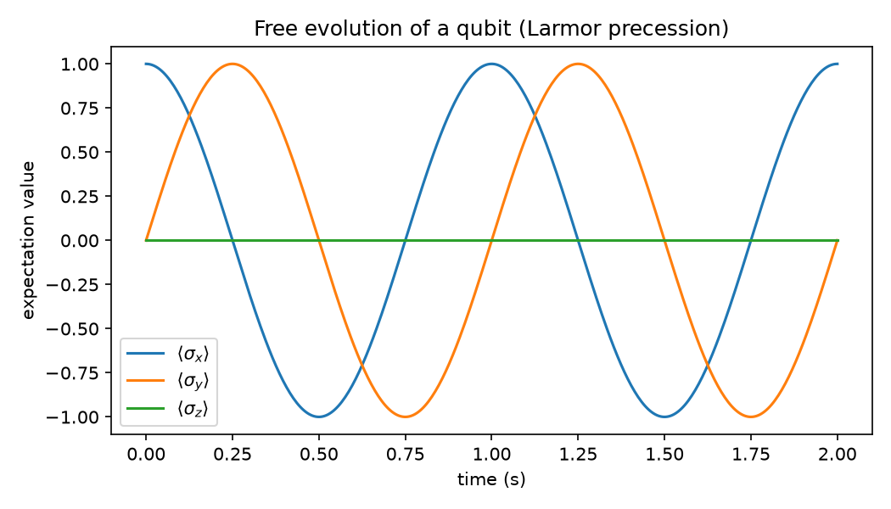

# Step 2: Core Qubit Model

Modeled a qubit as a two-level system using `qutip.basis` and the Pauli operators
(`sigmax`, `sigmay`, `sigmaz`). Simulated free evolution under a static
`H = 0.5 * omega * sigma_z` Hamiltonian starting from an equatorial state `|+>`.

**Result:** `<sigma_x>` and `<sigma_y>` oscillate sinusoidally (90 degrees out of
phase) at the qubit frequency, while `<sigma_z>` stays at 0 — this is Larmor
precession around the z-axis, exactly as expected for a two-level system with no
drive. The oscillation period matches `2*pi/omega` to machine precision.

This confirms the qubit model and the Hamiltonian convention (`H = omega/2 * sigma_z`)
used going forward, before adding any control drive.
