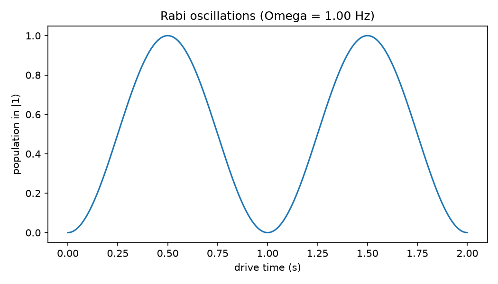

# Step 3: Basic Control Pulse (Rabi Drive)

Simulated a resonant microwave drive in the frame rotating at the drive frequency,
where the Hamiltonian reduces to a constant `H = (Omega/2) * sigma_x`. Starting
from `|0>`, the population in `|1>` oscillates sinusoidally at the Rabi frequency
`Omega` — this is a Rabi oscillation.

**Pi-pulse calibration:** a full population inversion (`|0> -> |1>`) happens after
half a Rabi period, `t_pi = pi / Omega`. For `Omega = 2*pi` rad/s (1 Hz), this
gives `t_pi = 0.5` s, confirmed numerically: population in `|1>` reaches `1.0000`
at that duration.

The Bloch-sphere trajectory (`figures/step3_bloch_pi_pulse.png`) shows the state
tracing a half-circle from the north pole (`|0>`) to the south pole (`|1>`) around
the x-axis, which is exactly what a pi-pulse should do.

This pi-pulse is the basic control primitive everything downstream depends on:
calibration (Step 5) means finding this duration/amplitude automatically and
robustly, even when the qubit frequency or drive strength isn't known exactly.
