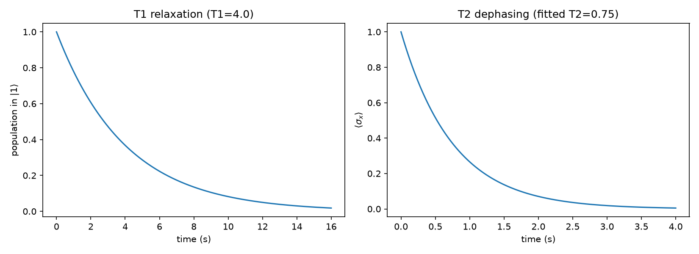

# Step 4a: Decoherence via Collapse Operators (T1/T2)

Added Lindblad collapse operators to `mesolve` to model the two standard
decoherence channels:

- **T1 (energy relaxation):** `sqrt(1/T1) * sigmap()`. Note: with the basis
  convention `basis(2,0) = |0>`, `basis(2,1) = |1>`, QuTiP's `sigmap()` (not
  `sigmam()`) is the operator that maps `|1> -> |0>` — the naming is a
  gotcha worth documenting in code, since using `sigmam()` silently does
  nothing to a qubit prepared in `|1>`.
- **T2 (dephasing):** an additional pure-dephasing operator
  `sqrt(gamma_phi) * sigmaz()`, with `gamma_phi` chosen so the *effective*
  T2 (fit to the decay of `<sigma_x>`) respects the physical bound `T2 <= 2*T1`.

**Verification:** population in `|1>` decays as a clean exponential with the
fitted T1 matching the input to 4 decimal places; `<sigma_x>` coherence decays
similarly under combined relaxation + dephasing.

**Effect on the Step 3 pi-pulse:** re-ran the calibrated pi-pulse with T1 swept
from 2x to 200x the pulse duration (T2 = 1.5*T1). Fidelity (population
transferred to `|1>`) rises from ~0.80 to ~0.998 as decoherence times grow
relative to the pulse duration — a direct, quantitative illustration of why
"fast pulses relative to T1/T2" matters for real hardware.

