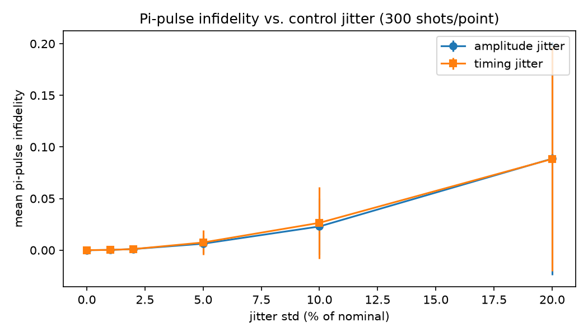
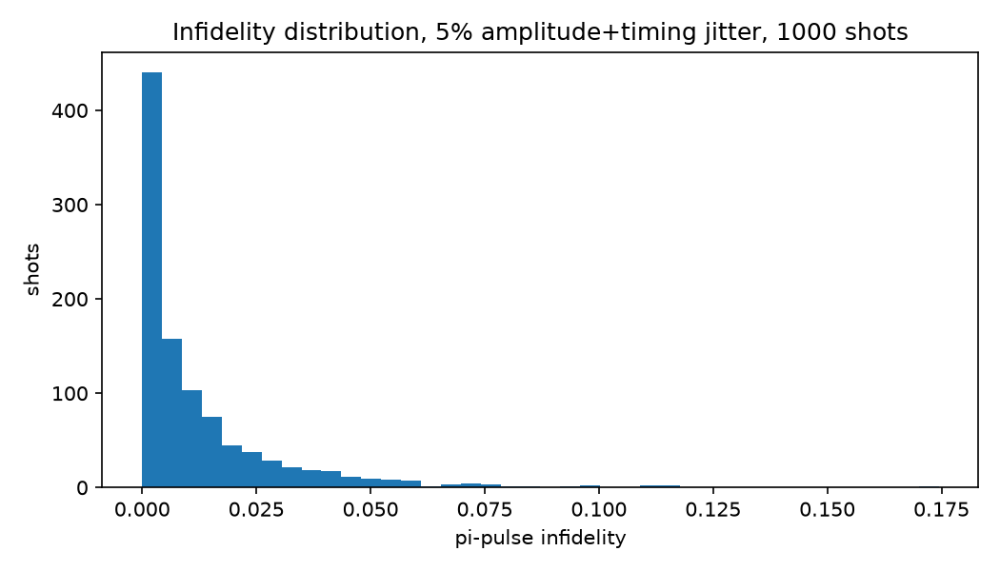

# Step 4b: Pulse Amplitude and Timing Jitter

Modeled shot-to-shot control imprecision: on each shot, the Rabi drive
amplitude and/or the pulse duration are perturbed by independent Gaussian
noise (`std` as a fraction of the nominal value) around the ideal pi-pulse
calibrated in Step 3. Ran a 300-shot Monte Carlo at each jitter level.

**Result:** mean infidelity grows roughly quadratically with jitter std for
both amplitude and timing jitter (they contribute about equally) — e.g. 5%
jitter costs ~0.6% infidelity, while 20% jitter costs ~9%. This matches the
expected behavior for small-angle errors around a calibrated pi rotation.

The per-shot distribution at a realistic 5% jitter level is heavily
right-skewed (most shots land close to ideal, a long tail of bad shots) —
this is the kind of spread a calibration/feedback routine has to be robust
to, not just compensate for on average.

