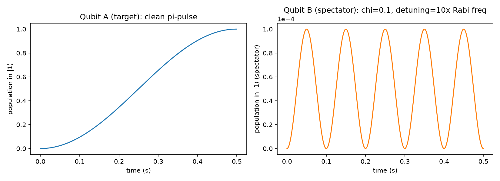

# Step 4c: Crosstalk Between Control Channels

Modeled a two-qubit Hilbert space (`qutip.tensor`) where qubit A's control
line leaks a fraction `chi` of its drive amplitude onto a neighboring qubit
B's control line — a classical control-hardware effect (e.g. capacitive
coupling between nearby wires), not a qubit-qubit interaction. Working in
the frame rotating at A's drive frequency:

```
H = (Omega_A/2) sigma_x^A + (Delta/2) sigma_z^B + (chi * Omega_A/2) sigma_x^B
```

where `Delta` is the frequency detuning between the two qubits.

**Result:** with `chi=0.1` and `Delta = 10x` the Rabi frequency, qubit A
still flips cleanly to `|1>` (`pop_A(t_pi) = 1.0000`), while qubit B — which
never sees a resonant drive — undergoes a small unwanted "spectator" Rabi
oscillation, peaking at population `~1e-4`.



**Scaling with qubit spacing:** swept the detuning from 1x to 200x the Rabi
frequency and measured the peak leaked population on B. It falls off as
`1/Delta^2`, matching the standard off-resonant-driving formula
`(chi*Omega)^2 / ((chi*Omega)^2 + Delta^2)` almost exactly across four orders
of magnitude.


This is the concrete, quantitative reason real multi-qubit chips need
sufficient frequency spacing (or active crosstalk cancellation) between
neighboring qubits — and it's the first script in this project that uses a
multi-qubit Hilbert space, setting up Step 6.
