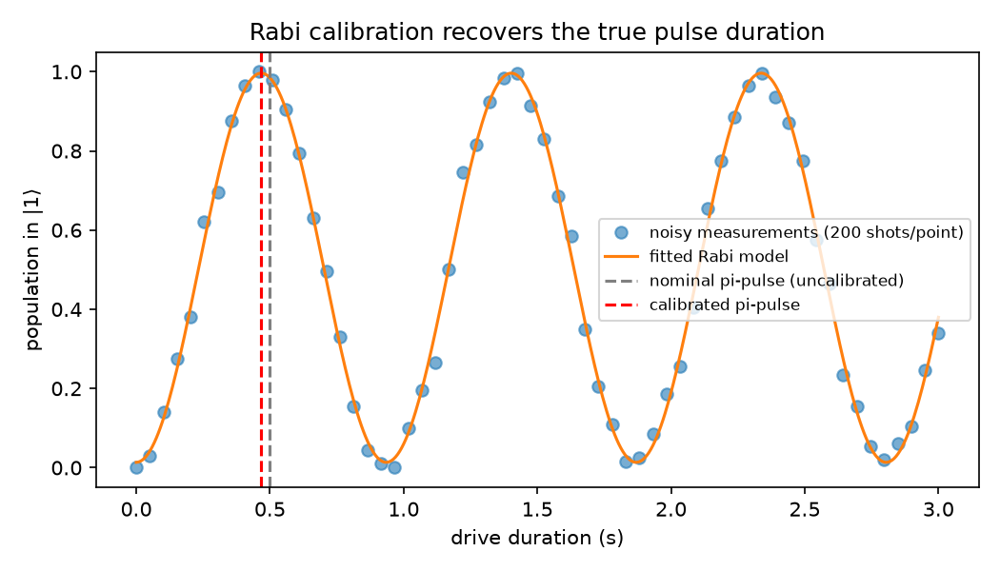
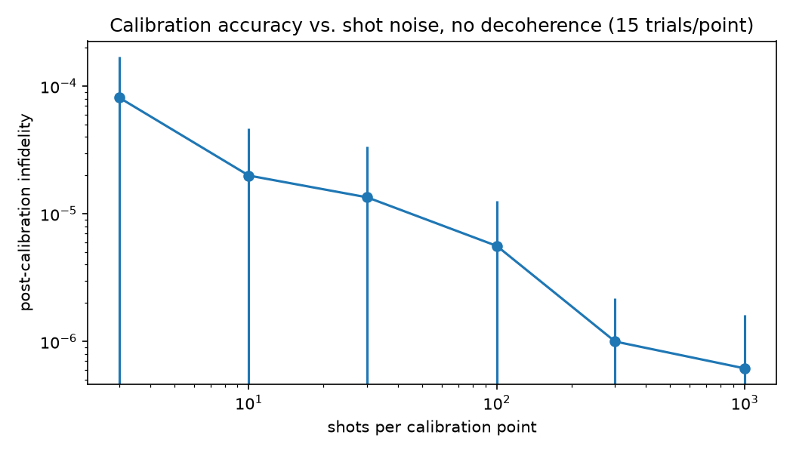
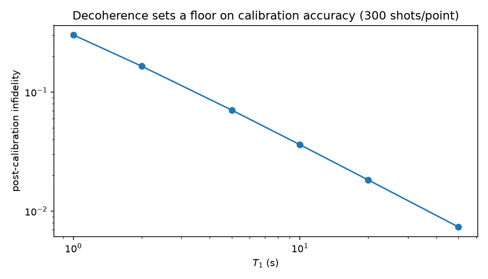

# Step 5: Automated Calibration Routine

This is the "hardware architecture" core of the project: rather than assuming
we know the qubit's exact Rabi frequency (as Steps 1-4 did), the qubit is
treated as a black box with an unknown true Rabi frequency (`7%` off the
nominal design value, standing in for amplifier gain drift). The calibration
routine mimics a real experiment:

1. Sweep the drive duration over several Rabi periods.
2. At each duration, take a finite number of projective measurement shots
   (binomial sampling around the true population — real shot noise, not
   just added Gaussian noise on the mean).
3. Fit a decaying-sinusoid Rabi model to the noisy curve.
4. Extract the pi-pulse duration from the fitted frequency.

**Payoff of calibrating:** blindly using the nominal (uncalibrated) pi-pulse
duration only reaches 98.44% population transfer (limited by the 7% frequency
error); the calibrated pulse reaches 99.63%, matching the intrinsic
decoherence-limited ceiling for this T1/T2.

**Calibration accuracy vs. shot noise** (isolated from decoherence, T1=T2=inf):
post-calibration infidelity falls from ~8e-5 at 3 shots/point to ~6e-7 at
1000 shots/point — more measurement shots make the Rabi fit, and hence the
calibrated pi-pulse, more accurate, exactly as it would on real hardware
choosing an averaging time.

**Calibration accuracy vs. decoherence** (fixed 300 shots/point, T2=0.75*T1):
even a perfect calibration can't beat the decoherence incurred *during* the
pi-pulse itself — infidelity falls from 30% at T1=1s to 0.7% at T1=50s,
following an approximate power law. This is the noise floor no amount of
extra calibration shots can fix; only faster pulses or longer-lived qubits
can.

**Takeaway:** two independent noise sources limit real calibration —
measurement statistics (fixable by taking more shots, at a time cost) and
decoherence (a hard physical floor). A good calibration routine needs enough
shots to not be measurement-noise-limited, but no amount of shots rescues a
qubit whose T1/T2 is too short relative to the pulse being calibrated.
