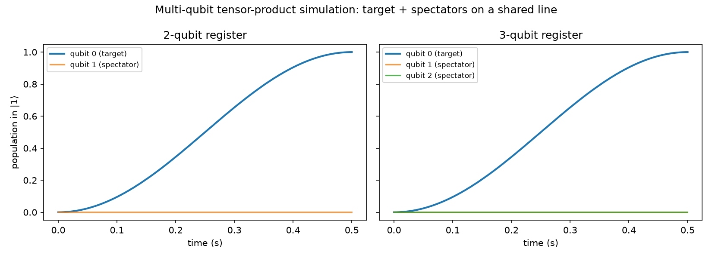
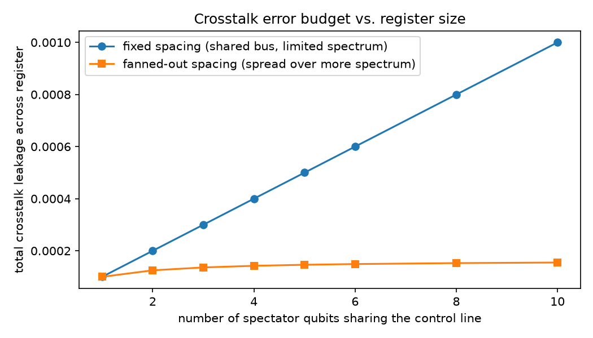

# Step 6: Multi-Qubit Scaling

Generalized the Step 4c crosstalk model from one spectator qubit to a small
register, built as an explicit multi-qubit tensor-product Hilbert space
(`qutip.tensor`) — the concrete "2-3 qubits with shared control lines and
crosstalk" the roadmap asks for.

**Key structural fact:** none of the Hamiltonian terms couple different
qubits — crosstalk here is classical leakage between control lines, not a
physical qubit-qubit interaction — so `H = H_0 + H_1 + ... + H_{N-1}` acts on
separate tensor factors and a product initial state stays a product state
for all time *exactly*. Verified this numerically: the full tensor-product
simulation agrees with treating each spectator as an independent single-qubit
problem to within `~1e-6` (limited by the ODE solver's tolerance, not the
physics).

That equivalence means the much cheaper independent-qubit calculation can be
used to explore register sizes well beyond 3 qubits without paying for an
exponentially large Hilbert space — a good example of exploiting problem
structure rather than brute-forcing a bigger simulation.

**Scaling result:** compared two frequency-allocation strategies as spectator
count grows from 1 to 10:

- **Fixed spacing** (every qubit crowded onto the same detuning, e.g. because
  spectral bandwidth is limited): total crosstalk leakage across the register
  grows *linearly* with qubit count — each additional qubit adds a fixed
  chunk to the error budget.
- **Fanned-out spacing** (each additional qubit pushed further away in
  frequency): leakage growth *saturates*, since leakage falls off as
  `1/detuning^2` (Step 4c) and detuning grows with each new qubit.

**Takeaway, tying back to the project's motivation:** this is a concrete,
quantitative version of the classical control problem behind scaling quantum
hardware. A control architecture that doesn't actively manage frequency
allocation (or use other crosstalk-suppression techniques) pays a
linearly-growing error tax per qubit added; one that does can substantially
flatten that curve. It's exactly the kind of software-visible tradeoff that
modular, scalable control hardware needs to be designed around.
